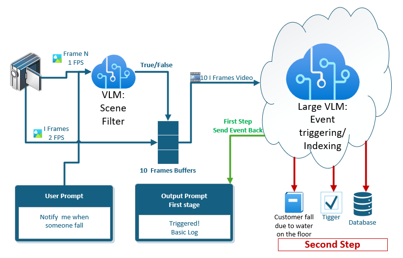
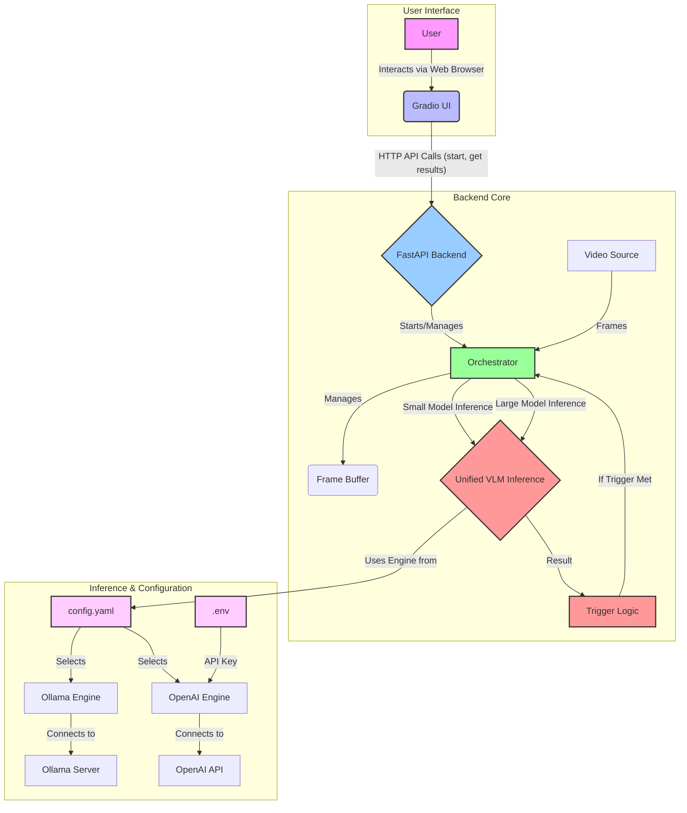

# VLM Camera Service
[](https://deepwiki.com/giladnah/VLM-Demo)

A Vision-Language Model (VLM) Camera Service for real-time video analysis using small and large VLMs (e.g., Qwen2.5vl, OpenAI GPT-4o) via a unified inference engine. It provides:
- A FastAPI backend for orchestration, inference, and API endpoints.
- A Gradio-based web UI for user interaction.
- Modular Python code for video streaming, buffering, inference, and trigger logic.
- Secure, engine-agnostic configuration supporting both local (Ollama) and cloud (OpenAI) inference.

---

## Architecture & Main Components

**1. FastAPI Backend (`app.py`)**
- Exposes REST API endpoints for orchestration, inference, trigger updates, and health checks.
- Can be run directly (`python app.py`) or with Uvicorn.

**2. Orchestrator (`orchestrator.py`)**
- Manages the video processing pipeline: video stream acquisition, frame grabbing, buffering, inference, and trigger logic.
- Uses multiprocessing for inference.

**3. Unified Inference System**
- `inference/unified.py`: Unified async entry point for all inference (small/large, any engine).
- `inference/engine.py`: Protocols, configs, and result models.
- `inference/ollama_engine.py`: Ollama engine implementation.
- `inference/openai_engine.py`: OpenAI engine implementation.
- Engine selection and configuration is handled via `config.yaml`.

**4. Video and Buffering**
- `video_source.py`: Handles video stream input and I-frame extraction.
- `buffer.py`: Manages a fixed-size frame buffer using a deque.

**5. Trigger Logic**
- `trigger.py`: Evaluates whether the inference result meets the trigger condition.

**6. Gradio UI (`gradio_runner.py`)**
- User-friendly web interface for selecting video sources, setting triggers, starting orchestration, and viewing results/logs.
- Communicates with the FastAPI backend via HTTP.

**7. Configuration**
- `config.yaml`: Central config for model names, engine selection, server addresses, batch inference, debugging, and default triggers.
- `.env`: Used for secure secret handling (e.g., OpenAI API keys).

**8. Testing**
- `tests/`: Pytest-based unit tests for core modules.

---
## Architecture Diagram


## Architecture Implementation



---

## Application Flow

1. **Startup**: User starts the FastAPI backend (`app.py`) and Gradio UI (`gradio_runner.py`).
2. **User Interaction**: User selects a video source and trigger in the UI.
3. **Orchestration Start**: UI sends a `/start` request to the backend, which initializes the orchestrator.
4. **Frame Processing**:
    - The orchestrator grabs frames from the video source.
    - For each frame:
        - **Small Model Inference**: The orchestrator uses the engine and model specified in `config.yaml` (via the `engine` field: `ollama` or `openai`) for small model inference, using the unified inference system.
        - If the trigger is met, **Large Model Inference** is run, again using the engine/model specified in `config.yaml`.
        - The unified inference system (`UnifiedVLMInference`) abstracts engine selection and configuration, supporting both Ollama and OpenAI (and future engines).
    - Results are standardized and returned to the orchestrator.
5. **Results**: Results and logs are updated and polled by the UI.
6. **User Actions**: User can update triggers, upload images for direct inference, or monitor system health.
7. **Secure Configuration**: All secrets (e.g., OpenAI API keys) are handled via environment variables or `.env` files, never committed to git.

---

Opens and future tasks:
- Add Hailo inference engine
- Add support for multiple triggers (Different triggers for small and large models)
- Add live video streaming to UI
- Add support for modifying the prompt (currently defined in per engine code)
- Fine tune application flow, and performance.
- Refactor code to be more modular and easier to maintain.
- Consider which VLM provider to use (Ollama, OpenAI, QWEN, Open Router etc.)
- Consider building a UI only application, depends on Hailo RESTful API.


## Setup and Installation

1. **Install Ollama CLI (if using Ollama)**
   - See [ollama.com](https://ollama.com/) for your OS.
2. **Download VLM Models (Ollama only)**
   - Small: `ollama pull qwen2.5vl:3b`
   - Large: `ollama pull qwen2.5vl:7b`
3. **Set up Python Virtual Environment**
   - `python3 -m venv venv`
   - `source venv/bin/activate`
4. **Install Python Dependencies**
   - `pip install -r requirements.txt`
5. **Set up OpenAI API Key (if using OpenAI engine)**
   - Create a `.env` file in the project root:
     ```
     OPENAI_API_KEY=sk-...your-key-here...
     ```
   - Or export it in your shell:
     ```bash
     export OPENAI_API_KEY=sk-...your-key-here...
     ```
   - **Never commit your API key to git!**

---

## Running the Application

1. **Ensure Ollama Service is Running (if using Ollama)**
2. **Activate Virtual Environment**
3. **Start the FastAPI Server**
   - `python app.py` or `uvicorn app:app --host 0.0.0.0 --port 8000 --reload`
   - API at `http://localhost:8000` (see `/docs` for OpenAPI)
4. **Start the Gradio UI**
   - `python gradio_runner.py`
   - UI at `http://localhost:7860`

---

## Unified Runner Script: `vlm_app_runner.py`

The recommended way to launch both the FastAPI backend and Gradio UI together for local development or demos is to use the unified runner script:

```sh
python vlm_app_runner.py
```

**Features:**
- Starts both FastAPI (`app.py`) and Gradio UI (`gradio_runner.py`) as subprocesses
- Streams logs from both processes with clear prefixes
- Prints process PIDs and exit codes for robust debugging
- If either process exits, both are terminated for safety
- Uses unbuffered output for real-time log streaming

**Recommended for:**
- Local development
- Demos and testing
- Ensuring both services are running and monitored together

---

## Configuration: `config.yaml` (All Supported Options)

This file controls model selection, inference engine, server addresses, batch inference, debugging, and default triggers.

**Example:**
```yaml
small_model:
  name: qwen2.5vl:3b                # Model name for small model (Ollama or OpenAI)
  ollama_server: http://10.41.74.178:11434  # Ollama server address (if using Ollama)
  engine: ollama                  # (default) options: ollama, openai

large_model:
  # Ollama example:
  # engine: ollama
  # name: qwen2.5vl:7b
  # ollama_server: http://10.41.74.178:11434
  # ollama_server: http://localhost:11434 # local ollama server

  # OpenAI example:
  engine: openai  # options: openai, ollama
  name: gpt-4o-mini  # Use OpenAI GPT-4o (vision)
  # If engine: openai, the OpenAI API key must be set in the environment or .env file
  batch_inference:
    enabled: true           # Enable batch mode for large inference (OpenAI only)
    batch_size: 4           # Number of images to send in a batch
    min_time_diff_seconds: 0.5 # Minimum time difference between images in the batch

server_ips:
  backend: "http://localhost:8000"  # The address where the FastAPI backend service is running
  gradio: "http://localhost:7860"   # The address where the Gradio UI service is running

default_triggers:
  - "a person lying on the floor"

rtsp_cameras:
  - name: "Office Camera"
    address: "rtsp://192.168.241.62/axis-media/media.amp"
    username: "root"
    password: "hailo"

# --- Debugging ---
debug_save_frames: true # save inference frames to jpeg files for debugging purposes
```

### Option Descriptions
- **small_model.name**: The model name for the small model (Ollama or OpenAI).
- **small_model.ollama_server**: Ollama server address for the small model (if using Ollama).
- **small_model.engine**: (Optional) Engine to use for the small model (`ollama` or `openai`).
- **large_model.name**: The model name for the large model (Ollama or OpenAI).
- **large_model.engine**: Engine to use for the large model (`ollama` or `openai`).
- **large_model.ollama_server**: Ollama server address for the large model (if using Ollama).
- **large_model.batch_inference.enabled**: Enable batch mode for large inference (OpenAI only).
- **large_model.batch_inference.batch_size**: Number of images to send in a batch (OpenAI only).
- **large_model.batch_inference.min_time_diff_seconds**: Minimum time difference between images in the batch (OpenAI only).
- **server_ips.backend**: The address where the FastAPI backend service is running.
- **server_ips.gradio**: The address where the Gradio UI service is running.
- **default_triggers**: List of default trigger descriptions.
- **rtsp_cameras**: List of RTSP camera sources. Each camera can have:
  - `name`: Camera name
  - `address`: RTSP URL
  - `username`: (Optional) Username for camera
  - `password`: (Optional) Password for camera
- **debug_save_frames**: If true, saves frames for debugging purposes.

#### Notes
- If you change the model names, make sure to pull the corresponding models on your Ollama server.
- For OpenAI models, ensure your `OPENAI_API_KEY` is set in your environment or `.env` file.
- Batch inference is only supported for OpenAI engines.

---

## Running Tests

1. **Activate Virtual Environment**
2. **Run Pytest**
   - `python -m pytest`

---

### Live Integration Test: Real Inference with Current Configuration

A special integration test is provided in `tests/test_live_inference.py` to verify that your backend and models are working end-to-end with your current `config.yaml`.

**What it does:**
- Loads your current `config.yaml`.
- For both the small and large model configuration:
  - Prints the model-specific configuration (engine, model name, etc).
  - Runs a real inference using a dummy image and a simple prompt ("a cat on a couch").
  - Prints the full inference result (including the model's analysis and engine used).
- Skips with a clear message if the config, required service, or environment variable is missing.

**How to run:**
```sh
python -m pytest -s tests/test_live_inference.py
```

**What to expect:**
- You will see debug output for both small and large models, including which engine/model is being used and the actual inference result.
- If a required service is not running or config is missing, the test will skip with a clear message.

**Use this test to:**
- Quickly verify that your Ollama or OpenAI backend is working with your current configuration.
- Debug configuration or service issues before running more complex workflows.


---

## API Endpoints

- **GET /**: Welcome message.
- **GET /health**: Health check for the service and models.
- **POST /start**: Starts or restarts the video processing orchestration.
- **PUT /trigger**: Updates the trigger for the active orchestration.
- **POST /infer/small**: Directly runs small VLM inference on the uploaded image.
- **POST /infer/large**: Directly runs large VLM inference on the uploaded image.

See `http://localhost:8000/docs` when running for full API documentation.

---

## Troubleshooting & FAQ

- **Ollama errors:** Ensure the Ollama service is running and models are pulled.
- **OpenAI errors:** Ensure your `OPENAI_API_KEY` is set in your environment or `.env` file. If you see errors about missing API keys, check your `.env` and restart the app.
- **Webcam/RTSP issues:** Check device permissions and network connectivity.
- **Tests failing:**
  - The tests for "inference" will use your current config.yaml, so make sure it is correct.
  - Ensure all dependencies are installed and the virtual environment is active.
  - Ensure the Ollama service is running and models are pulled.
  - Ensure your `OPENAI_API_KEY` is set in your environment or `.env` file.

---

## Contributing

See `PLANNING.md` and `TASKS.md` for architecture, style, and open tasks.

---

# Setting Up an Ollama Server for Remote REST API Access

To use a remote Ollama server for inference (small or large models), follow these steps:

## 1. Install Ollama on the Remote Machine
- Follow the official instructions: https://ollama.com/download

## 2. Start Ollama Listening on All Interfaces
By default, Ollama listens only on `127.0.0.1` (localhost), which is not accessible from other machines.

**To allow remote access, start Ollama with:**

```sh
OLLAMA_HOST=0.0.0.0 ollama serve
```
## 3. Installing Required Models

This project requires specific vision-language models to be available on your Ollama server. You must pull these models before running the backend or orchestrator.

### Start the Ollama Server
If not already running, start the Ollama server on your machine:
```bash
ollama serve
```

### Pull Required Models
Run these commands on your Ollama server:
```bash
ollama pull qwen2.5vl:3b
ollama pull qwen2.5vl:7b
```

You can check which models are available with:
```bash
ollama list
```

If you change the model names in `config.yaml`, make sure to pull the corresponding models.

## 3. Open Firewall Port (if needed)
- Ensure port `11434` is open to your client machine(s).
- On Ubuntu with UFW:
  ```sh
  sudo ufw allow 11434/tcp
  ```
- On CentOS/RedHat with firewalld:
  ```sh
  sudo firewall-cmd --add-port=11434/tcp --permanent
  sudo firewall-cmd --reload
  ```

## 4. Test Remote Access
From your client machine, run:
```sh
curl http://10.41.74.178:11434/api/tags
```
You should receive a JSON response describing the available models.

Run a test inference:
```sh
curl -X POST http://<REMOTE_IP>:11434/api/generate \
  -H "Content-Type: application/json" \
  -d '{"model": "qwen2.5vl:7b", "prompt": "Respond with: You are good to go!", "stream": false}'
```

You should receive a JSON response from the model.

## Troubleshooting
- If you get `Connection refused`, make sure Ollama is running and listening on `0.0.0.0:11434`.
- If you get a timeout, check firewall rules on both the server and client side.
- You can test locally on the server with:
  ```sh
  curl -X POST http://localhost:11434/api/generate ...
  ```
- If you want to restrict access, consider using a VPN or firewall rules to limit which IPs can connect.
- If you see errors about missing models, double-check the spelling and version in both `config.yaml` and your `ollama list` output.
- If the Ollama server is running on a remote machine, ensure the `ollama_server` URL in `config.yaml` points to the correct address and port.

## Secure OpenAI API Key Handling

- **Never commit your OpenAI API key to git or hard-code it in code.**
- The OpenAI engine will use the `OPENAI_API_KEY` environment variable if not set in code.
- For local development, use a `.env` file (with `python-dotenv`) to load environment variables automatically.
- A template `.env.example` is provided. Copy it to `.env` and add your real key.
- `.env` is in `.gitignore` and will never be committed.

**.env.example**
```
# Example .env file for local development
# Copy this file to .env and fill in your actual API key
OPENAI_API_KEY=sk-...your-key-here...
```

**How to use in your script:**
```python
from dotenv import load_dotenv
load_dotenv()
```

**In production:**
- Set the `OPENAI_API_KEY` environment variable in your deployment environment (e.g., Docker, cloud, CI/CD, etc).


# Hailo Inference
It is built around the qwen-VL demo, https://hailotech.atlassian.net/wiki/spaces/CS/pages/2204664099/QWEN2-VL-2B+Demo+Installation

Not implemented yet.

